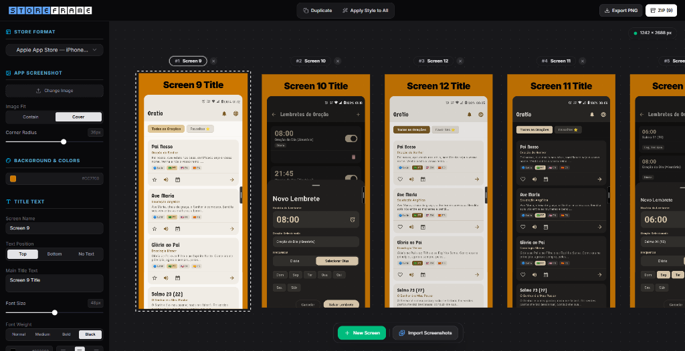

# 🖼️ StoreFrame — App Store & Play Store Mockup Studio

<div align="center">

**Generate high-converting, professional app store screenshot mockups in seconds.**

[](https://react.dev/)
[](https://vitejs.dev/)
[](https://tailwindcss.com/)
[](https://bun.sh/)
[](LICENSE)

<br />

<p align="center">
  
</p>

</div>

---

## ✨ Features

- 📱 **Store Format Presets**: Native support for **Apple App Store** (`1242 × 2688 px`) and **Google Play Store** (`1440 × 2560 px`).
- 🎨 **Minimalist Studio Controls**: Clean sidebar controls positioned at the top for store selection, image upload, zoom, and background styling.
- 🔍 **Central Image Zoom**: Dedicated image scaling slider (`80%` to `160%`) and corner radius rounding controls.
- 🏁 **Background Patterns & Color Palette**: Solid background color picker with live hex badges and background textures (No stripes, Diagonal stripes, Vertical stripes, and Dot Grid).
- 📑 **Multi-Screen Tab Dock**: Easily add, duplicate, rename, and delete screen cards in a browser-like tab bar.
- 🗂️ **Grid Overview Mode**: View all store screens side-by-side in a responsive studio grid to compare visual identity across your entire store listing.
- 🪄 **Style Sync**: Apply background colors, font styles, and corner radius across all screens with a single click.
- 📦 **HD PNG & Bulk ZIP Exporters**: Export individual active screens in full resolution or batch export all screens packaged into a ZIP archive.
- ⚡ **Ultra-Fast Development**: Powered by **Bun** and **Vite** for sub-second build times and instant hot module replacement.

---

## 🛠️ Tech Stack

- **Framework**: [React 19](https://react.dev/)
- **Build Tool & Bundler**: [Vite 6](https://vitejs.dev/)
- **Package Manager & Runtime**: [Bun](https://bun.sh/)
- **Styling**: [Tailwind CSS v4](https://tailwindcss.com/)
- **UI Components & Icons**: [Radix UI Primitives](https://www.radix-ui.com/) & [Lucide React](https://lucide.dev/)
- **Export Engine**: [html2canvas](https://html2canvas.hertzen.com/) & [JSZip](https://stuk.github.io/jszip/)

---

## 🚀 Getting Started

### Prerequisites

Ensure you have **Bun** installed on your system:

```bash
# Install Bun (if not already installed)
curl -fsSL https://bun.sh/install | bash
```

### Installation & Local Setup

```bash
# 1. Clone the repository
git clone https://github.com/carllosnc/store-frame.git

# 2. Navigate into the project directory
cd store-frame

# 3. Install dependencies using Bun
bun install

# 4. Start the local development server
bun run dev
```

The application will be running at `http://localhost:5173/`.

---

## 🏗️ Production Build

To build the production bundle:

```bash
bun run build
```

The optimized static assets will be compiled into the `dist/` directory.

---

## 🤝 Contributing

Contributions, issues, and feature requests are welcome! Feel free to check the [issues page](https://github.com/carllosnc/store-frame/issues).

---

## 📄 License

This project is [MIT](LICENSE) licensed. Created by [Carlos Costa](https://github.com/carllosnc).
